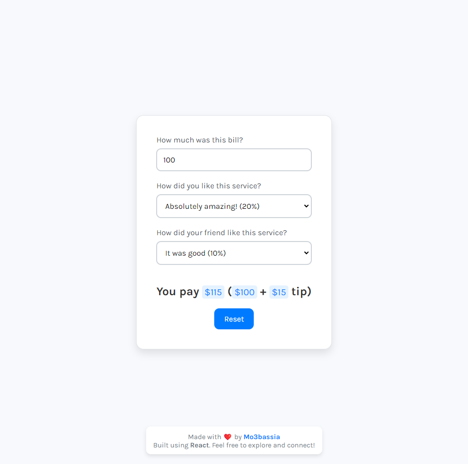

# Bill Tip Calculator 🍽️💰

>)

- This project was bootstrapped with [Create React App](https://github.com/facebook/create-react-app).

## Live Demo 🌐

- [Live Preview Here](https://tip-calculator-mo3bassias-projects.vercel.app)

## Overview 📋

This is a simple React application that allows users to calculate tips based on their bill amount and feedback on the service received. The application is designed to practice React fundamentals while creating a user-friendly interface.

## Features 🌟

- **Input Bill Amount**: Users can enter the total bill amount.
- **Select Service Rating**: Users can rate the service from "Dissatisfied" to "Absolutely Amazing!" with percentage options.
- **Result Display**: The app calculates and displays the total amount to be paid, including the calculated tip based on the average service rating.
- **Reset Functionality**: Users can reset the form to start a new calculation.

## Technologies Used ⚙️

- **React**: The application is built using React for a dynamic and responsive user interface.
- **JavaScript**: Used for implementing the app logic and state management.
- **CSS**: Styles are applied to enhance the UI and make it visually appealing.

## Learning Journey 🚀

This project is a small application I created as part of my learning process in React. I am currently focusing on mastering the basics of React, and this project serves as a practical exercise to reinforce my understanding of component-based architecture and state management.

Feel free to explore the code, provide feedback, or suggest improvements! 🙌
